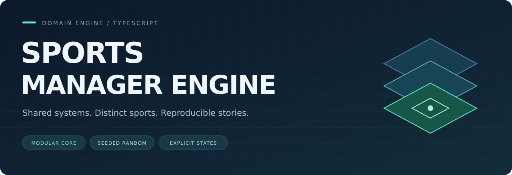
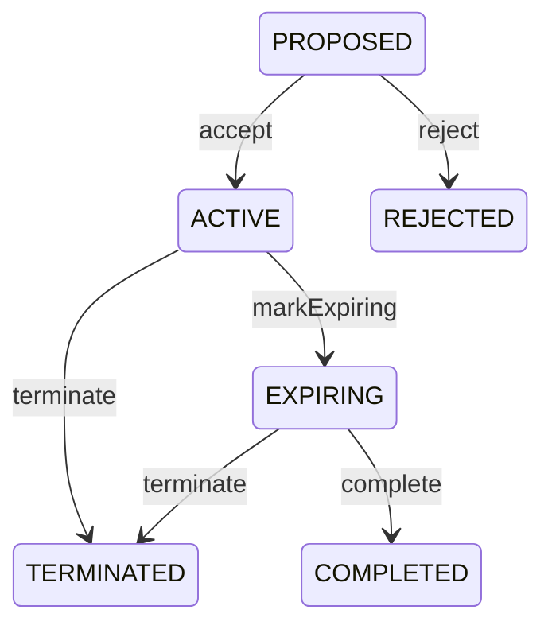

<p align="center">
  
</p>

<p align="center">
  
  
  
  
</p>

<p align="center">
  <a href="#quick-start">Quick start</a> ·
  <a href="#what-works-today">Current features</a> ·
  <a href="docs/ARCHITECTURE.md">Architecture</a> ·
  <a href="docs/ROADMAP.md">Roadmap</a>
</p>

# Sports Manager Engine

**A modular TypeScript foundation for sports management simulations, with MOBA Manager as its first planned playable ruleset.**

Sports management games share difficult problems: contracts, rosters, competitions, campaign state, and long-term consequences. This project separates those shared systems from the rules that make each sport different.

The goal is a reusable domain engine that runs independently of a user interface. Its first reference game will put the player in charge of a fictional esports organization, managing a roster, preparing drafts, and navigating a competitive season.

> **Current stage:** an executable domain foundation. Team management, contract transitions, and restorable seeded randomness are implemented. The match simulator, MOBA ruleset, browser UI, and durable save storage are still planned.

## What works today

| System | Implemented behavior | Code |
| :--- | :--- | :--- |
| Team | Rename teams; add and remove players; reject empty IDs and duplicate roster entries; export plain state | [Team.ts](src/engine/teams/Team.ts) |
| Contract | Validate identity, salary, and date ordering; enforce allowed lifecycle transitions; export plain state | [Contract.ts](src/engine/contracts/Contract.ts) |
| Seeded randomness | Generate repeatable sequences and bounded integers; capture and restore generator state | [SeededRandom.ts](src/engine/random/SeededRandom.ts) |
| Engine state | Load campaign data, initialize the RNG from its saved state, and explicitly synchronize it before taking a snapshot | [Engine.ts](src/engine/Engine.ts) |
| Domain models | Define people, organizations, competitions, seasons, fixtures, events, and career records as TypeScript data structures | [EngineState.ts](src/engine/save/EngineState.ts) |

The remaining domain models are **data contracts**, not completed gameplay systems. Save metadata already includes schema and rules versions; migration and compatibility enforcement are future work.

## Quick start

Use **Node.js 24** and npm. No database, API keys, or browser session are required for the current domain demo.

From the repository root:

```bash
npm ci
npm run check
npm run demo
```

The demo creates a team, accepts a contract, rejects a duplicate roster entry, and checks that a restored engine produces the same next random value after a JSON snapshot round trip.

```text
Sports Manager Engine | domain demo
Team: Aurora | 2 players
Duplicate roster entry: rejected
Contract: PROPOSED -> ACTIVE -> EXPIRING -> COMPLETED
JSON snapshot: restored
Next random value matches after reload: true
```

This exercises the current domain APIs. It does not simulate a match.

| Command | Purpose |
| :--- | :--- |
| `npm run typecheck` | Check TypeScript without emitting JavaScript |
| `npm run test:run` | Run the existing test suite once |
| `npm test` | Run tests in watch mode |
| `npm run check` | Run type checking and tests |
| `npm run demo` | Compile and run the standalone domain demonstration |

## Design in practice

### Behavior inside entities, plain data at the boundary

`Team` owns its roster rules. `TeamState` describes the data used to reconstruct or serialize it. Internally, the entity uses a `Set`; callers receive arrays rather than the live collection.

```ts
import { Team } from "./src/engine/teams/Team.js";

const team = new Team({
  id: "team-aurora",
  name: "Aurora",
  playerIds: ["player-1"],
});

team.addPlayer("player-2");

const snapshot = team.toState();
// { id: "team-aurora", name: "Aurora", playerIds: ["player-1", "player-2"] }
```

The same state/entity separation is used for contracts. It provides a clear persistence boundary without binding the domain to a database or ORM.

### Contract lifecycles are explicit

Operations express intent: `accept()`, `reject()`, `markExpiring()`, `terminate()`, and `complete()`. Invalid transitions throw before changing the status.



These transitions are currently invoked by the caller. Calendar-driven expiration and cross-contract eligibility checks are not implemented yet.

### Randomness can resume from a snapshot

A seed starts a sequence. The saved **RNG state** determines where that sequence resumes. `Engine.syncRandomState()` copies the current generator state into the campaign data before serialization.

```ts
engine.getRandom().next();
engine.syncRandomState();

const snapshot = structuredClone(engine.getState());
const expected = engine.getRandom().next();
const restored = new Engine(snapshot);

console.log(restored.getRandom().next() === expected); // true
```

See the [complete runnable example](examples/domain-demo.ts). Full campaign reproducibility will also require identical rules, inputs, versions, and random-call ordering.

## Architecture and boundaries

| Layer | Responsibility | Current stage |
| :--- | :--- | :--- |
| **Shared engine** | People, teams, organizations, contracts, competition state, history, events, and seeded randomness | Foundation implemented; domain behavior being expanded |
| **Sport ruleset** | Sport-specific attributes, eligibility, preparation, and match simulation | Planned; MOBA is the first target |
| **Web application** | Player-facing screens, commands, navigation, and reports | Planned |

Dependencies point toward the engine. The engine must not import MOBA heroes, lanes, draft logic, or UI components. Generic competition results already have their own model; the executable ruleset integration is a later milestone.

Abstractions are introduced when there is a concrete need. A second playable sport and a public plugin API are outside the first MVP.

[Read the architecture notes and current trade-offs →](docs/ARCHITECTURE.md)

## First reference game: MOBA Manager

The planned reference game follows one fictional esports organization through a national league and an offseason. Its main systems will include:

- Roster building, contracts, training, and scouting with imperfect information.
- Contextual picks and bans shaped by player proficiency, preparation, and the current patch.
- Simulated matches with a timeline and post-match reports.
- Institutional pressure from players, management, supporters, and sponsors.

The v0.2 specification targets an eight-team league, a 40-hero initial catalog, and one complete playable season. These describe the intended MVP, not content currently available in the repository.

## Quality and verification

The existing Vitest suite checks roster invariants, contract transitions, state export, seeded sequences, and RNG continuity after restoring an engine snapshot. TypeScript runs with `strict`, `noUncheckedIndexedAccess`, and `exactOptionalPropertyTypes` enabled.

The included [CI workflow](.github/workflows/ci.yml) runs type checking, tests, and the demo on pushes and pull requests. Its hosted status becomes available after the files are pushed to GitHub.

## Next milestones

1. Turn fixtures, seasons, organizations, and events into validated domain entities.
2. Add services for rules spanning contracts, rosters, and competitions.
3. Build durable persistence, runtime save validation, and compatibility handling.
4. Implement the MOBA ruleset and its integration with the shared engine.
5. Deliver a browser application and one complete playable season.

[See milestone acceptance criteria →](docs/ROADMAP.md)

## About the project

Built by [Carlos Eduardo Maroso Alves](https://github.com/kadualma1) as an independent software engineering and game systems project.

The work focuses on domain modeling, explicit state transitions, deterministic simulation foundations, and tested architectural boundaries. The repository is evolving toward a playable product, with each milestone adding executable behavior.

For a focused code review, start with [Team](src/engine/teams/Team.ts), [Contract](src/engine/contracts/Contract.ts), and the [engine restore tests](tests/engine/Engine.test.ts).
